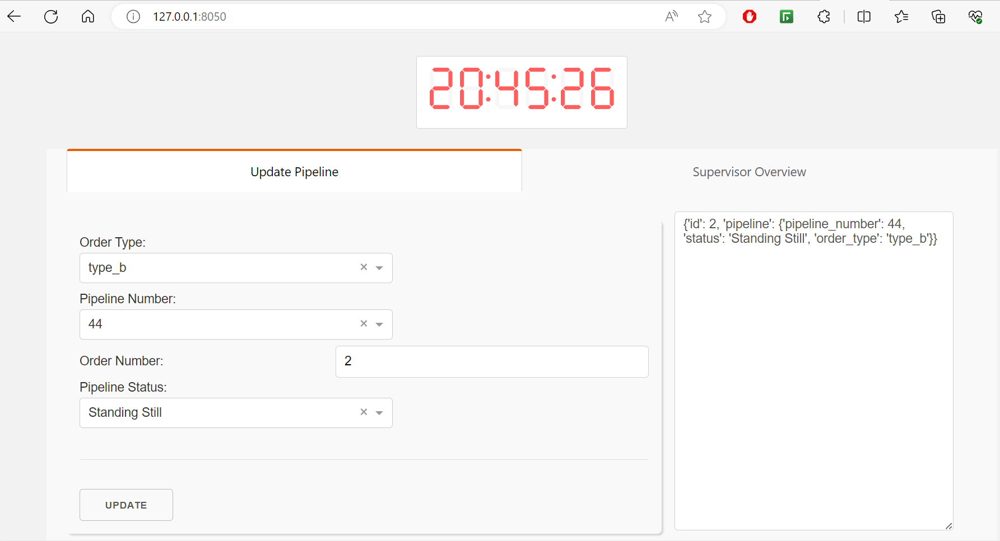
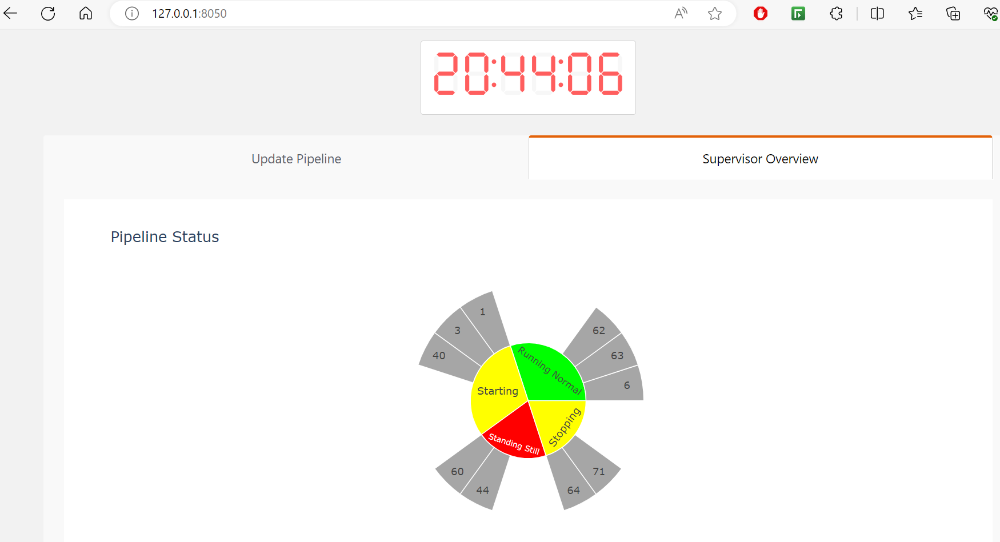

# Smarty Plant prototype
  - Kafka for real-time updates, Plotly-Dash for web-bases dashboards.
  - Workers update production pipeline status and orders.
  - Supervisor monitor status of production pipelines through sunburst plot.

# Usage:

- Create a conda environment and install dependencies.

        docker-compose up (Runs Kafka in a container)
        python application.py

# Worker and Supervisor dashboard.

Worker |  Supervisor
:-------------------------:|:--------------------------------------------------:
  |  